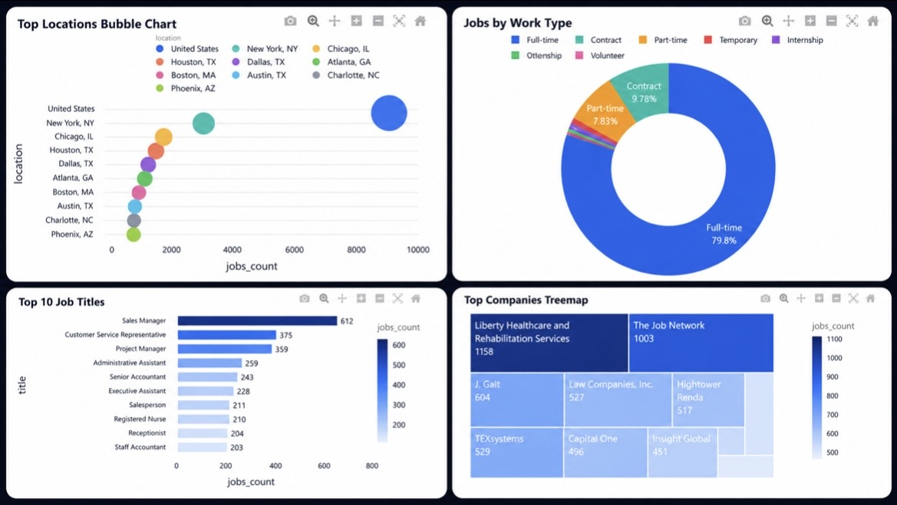

# 💼 Big Data Analytics for Job Market Trends

A full, end-to-end Big Data pipeline that analyzes over 123,000 LinkedIn job postings to uncover job market trends, in-demand skills, salary patterns, remote-work dynamics, and engagement signals — culminating in a Random Forest salary-level prediction model and an interactive Streamlit dashboard.



## Overview
This project goes beyond loading a CSV and making a few charts. It is a complete Big Data ecosystem covering **ingestion → raw storage → scalable PySpark processing → processed (Parquet) storage → analytics → machine learning → interactive visualization**, applied to the LinkedIn Job Postings dataset.

The project covers:

* **Data Ingestion** — validating and loading three linked source files
* **Raw Storage** — preserving original data untouched for reproducibility
* **PySpark Processing** — cleaning, salary preparation, salary-level labeling, remote-status normalization, and job–skill joins at scale
* **Processed Storage** — query-ready Parquet outputs
* **Analytics** — job titles, companies, locations, skills, salary insights, remote comparisons, and engagement metrics
* **Machine Learning** — a Spark MLlib Random Forest classifier predicting salary level (Low / Medium / High)
* **Visualization** — static chart generation for reporting
* **Interactive Dashboard** — a multi-tab Streamlit app with live filters and an in-app salary predictor

## Problem & Motivation
Students, graduates, and job seekers often lack a data-driven understanding of which skills are actually in demand, which job titles and locations offer the most opportunities, and how salaries differ between remote and on-site roles. This project processes real LinkedIn job posting data to turn that uncertainty into evidence-based insight.

## Dataset
**LinkedIn Job Postings (2023–2024)** — [Kaggle](https://www.kaggle.com/datasets/arshkon/linkedin-job-postings)

| File | Rows | Purpose |
|---|---|---|
| `postings.csv` | 123,849 | Core job posting data (title, company, location, salary fields, work type, remote status, views, applies) |
| `job_skills.csv` | 213,768 | Links each `job_id` to one or more skill abbreviations |
| `skills.csv` | 35 | Maps skill abbreviations to readable skill names |

**Key dataset facts** (from the initial data understanding step):
* 24,428 unique companies · 8,526 unique locations · 72,521 unique job titles
* 122,096 of 123,849 jobs have at least one mapped skill; all 35 skill abbreviations map successfully
* Only 36,073 jobs (~29%) include salary information — salary analysis and the ML model use this subset only

> ⚠️ **`postings.csv` is not included in this repo** (too large for GitHub). Download it from the Kaggle link above and place it in `data/raw/` — see [`data/raw/README.md`](data/raw/README.md) for details.

## Architecture

```
data/raw/ (postings.csv, job_skills.csv, skills.csv)
        │
        ▼
   ingestion/ingest_data.py         — validate files & columns, save raw copies
        │
        ▼
   processing/spark_processing.py    — PySpark: clean, salary_level, remote_status, join skills
        │
        ▼
   data/processed/*.parquet          — cleaned_postings, jobs_with_skills, job_skill_summary
        │
        ├──▶ analytics/run_analytics.py     — top titles/companies/locations/skills, salary & engagement insights
        │           │
        │           ▼
        │     visualization/generate_charts.py   — reports/figures/*.png
        │
        ├──▶ ml/salary_level_prediction.py   — Random Forest (Spark MLlib) salary-level classifier
        │           │
        │           ▼
        │     visualization/generate_ml_charts.py  — reports/figures/ml/*.png
        │
        ▼
   dashboard/app.py (Streamlit)      — interactive exploration + live salary prediction
```

## PySpark Processing
The processing stage (`processing/spark_processing.py`) removes duplicate postings, cleans text fields, converts salary values, normalizes remote status, and derives `salary_level` from percentile thresholds:

* **33rd percentile**: $59,750 · **66th percentile**: $106,000
* Resulting distribution: **High** 12,484 · **Medium** 12,021 · **Low** 11,568 · **Unknown** 87,776 (no salary data)

Cleaned outputs are saved as Parquet (`data/processed/`), which is more efficient than CSV for analytical workloads and preserves schema for downstream Spark/Python tools.

## Analytics
Before salary analysis, an outlier filter (`$10,000 ≤ salary ≤ $500,000`) removed 513 invalid records, leaving 35,560 salary records for analysis. Key generated outputs (`data/output/analytics/`) include top job titles/companies/locations/skills, salary by title/skill/location, remote vs. non-remote salary comparison, and engagement summaries.

## Machine Learning
A **Random Forest Classifier** (Spark MLlib) predicts `salary_level` (Low / Medium / High) using features: `title_group`, `location_group`, `work_type_final`, `remote_status`, `views`, `applies`, `experience_level_final`, and `skills_array`.

| Metric | Value |
|---|---|
| Training records | 28,596 |
| Testing records | 6,964 |
| **Accuracy** | **58.4%** |
| **F1-score** | **57.7%** |

The model performs best on the **High** and **Low** classes; the **Medium** class is harder to separate since medium salaries border both extremes. Full confusion matrix and sample predictions are in `data/output/ml/`.

## Dashboard (Streamlit)
`dashboard/app.py` ties everything together in a multi-tab interactive app:

* **Overview** — KPIs (postings, companies, locations, skills, avg. salary), work-type & salary-level donut charts, top-skills treemap
* **Job Trends** — top job titles, companies, locations, jobs by work type
* **Skills Demand** — top in-demand skills, skills linked to high salaries, remote-job skills, skills by selected title
* **Salary Insights** — salary by title/skill/location/level/remote status, with a salary-range filter
* **Engagement** — views/applies totals & averages, view–apply correlation, top viewed/applied jobs
* **Machine Learning Prediction** — interactive form (title, location, work type, remote status, experience, expected views/applies, skills) that returns a live Low/Medium/High salary prediction with probabilities
* **Recommendations** — data-driven skill recommendations based on current filters

Streamlit was chosen over Tableau because the whole pipeline is Python-native — Streamlit connects directly to the processed data, analytics results, and the live ML model in one app, using Plotly for interactive charts (hover, zoom, treemaps, donuts, bubble charts).

## Key Results
* **Top job title**: Sales Manager (673 postings), followed by Customer Service Representative, Project Manager, and Administrative Assistant.
* **Top skill category**: Information Technology, followed by Sales, Management, Manufacturing, and Health Care Provider.
* **Highest-paying skill categories**: Product Management, Legal, Strategy/Planning, Engineering, and Consulting.
* **Remote vs. on-site**: remote jobs showed a higher average and median salary among records with salary data (interpreted cautiously given missing salary data overall).
* **Engagement**: views and applications had a moderate positive correlation (**0.526**) — more views generally means more applications, but views alone don't determine outcomes.
* Full-time roles dominate the dataset (98,814 of 123,849 postings); only ~12.3% of postings allow remote work.

## Why This Is a Big Data Project
The dataset spans 123,849 postings and 213,768+ job–skill relationships, processed with **PySpark** for scalable cleaning, deduplication, and joins rather than single-machine tools. The architecture separates **raw** and **processed** storage layers for a repeatable, maintainable pipeline, and produces analytics, an ML model, and a live dashboard — a complete Big Data ecosystem rather than a single-notebook analysis.

## Tech Stack

* **Language**: Python
* **Big Data Processing**: PySpark (Spark MLlib for ML)
* **Data Formats**: CSV (raw), Parquet (processed/analytics)
* **ML**: scikit-learn, Spark MLlib (Random Forest)
* **Visualization**: Matplotlib, Plotly
* **Dashboard**: Streamlit

## Project Structure

```
job-market-big-data-analytics/
├── data/
│   ├── raw/
│   │   ├── job_skills.csv
│   │   ├── skills.csv
│   │   └── README.md            # instructions to download postings.csv
│   ├── processed/                # generated by spark_processing.py (git-ignored)
│   └── output/
│       ├── analytics/            # analytics results (CSV + Parquet)
│       ├── ml/                   # ML metrics, confusion matrix, sample predictions
│       ├── dataset_profile.txt
│       ├── spark_processing_summary.txt
│       ├── processed_storage_summary.txt
│       └── analytics_summary.txt
├── ingestion/
│   ├── ingest_data.py
│   └── dataset_understanding.py
├── processing/
│   ├── spark_processing.py
│   └── processed_storage.py
├── analytics/
│   └── run_analytics.py
├── ml/
│   └── salary_level_prediction.py
├── visualization/
│   ├── generate_charts.py
│   └── generate_ml_charts.py
├── dashboard/
│   └── app.py
├── reports/
│   ├── figures/                  # generated charts (analytics + ML)
│   └── screenshots/
│       └── dashboard_overview.jpg   # dashboard screenshot shown above
├── docs/
│   ├── Big_Data_Project_Report.docx   # full written report
│   └── Project_commands.docx          # step-by-step run commands (Arabic/English)
├── requirements.txt
└── .gitignore
```

## How to Use

1. **Install dependencies**

```
pip install -r requirements.txt
```

2. **Add the dataset** — download `postings.csv` from [Kaggle](https://www.kaggle.com/datasets/arshkon/linkedin-job-postings) and place it in `data/raw/` (see `data/raw/README.md`). `job_skills.csv` and `skills.csv` are already included.

3. **Run data ingestion**

```
python ingestion/ingest_data.py
```

Validates the three source files and prints a dataset profile (row/column counts, unique companies/locations, salary availability).

4. **Run PySpark processing**

```
python processing/spark_processing.py
```

Cleans the data, derives `salary_level`, normalizes remote status, joins jobs with skills, and writes Parquet files to `data/processed/`.

5. **Run analytics**

```
python analytics/run_analytics.py
```

Generates top titles/companies/locations/skills, salary insights, remote comparisons, and engagement summaries into `data/output/analytics/`.

6. **Generate analytics charts**

```
python visualization/generate_charts.py
```

Saves chart images to `reports/figures/`.

7. **Train the salary-level prediction model**

```
python ml/salary_level_prediction.py
```

Trains the Random Forest classifier and saves accuracy/F1/confusion-matrix/sample predictions to `data/output/ml/`.

8. **Generate ML result charts**

```
python visualization/generate_ml_charts.py
```

Saves `model_performance.png`, `confusion_matrix.png`, `train_distribution.png`, and `test_distribution.png` to `reports/figures/ml/`.

9. **Launch the dashboard**

```
streamlit run dashboard/app.py
```

Opens the interactive dashboard, typically at `http://localhost:8501`.

## Limitations
* Only ~29% of postings include salary data, so salary analysis and the ML model rely on a subset of the full dataset.
* Some company names are missing and were replaced with "Unknown Company" during processing.
* The dataset reflects LinkedIn postings only and may not represent the full job market (other platforms may show different patterns).
* Skill categories (e.g. "Information Technology", "Management") are broad; they don't capture granular technical skills like Python, SQL, or AWS individually.

## Ethics & Privacy
This project uses a public, job-posting-level dataset for educational purposes. It does not analyze individual applicants or personal profiles — all analysis is performed at the level of postings, companies, locations, skills, and salary categories.

## Authors
Rawan Mansour

This was a team project.
